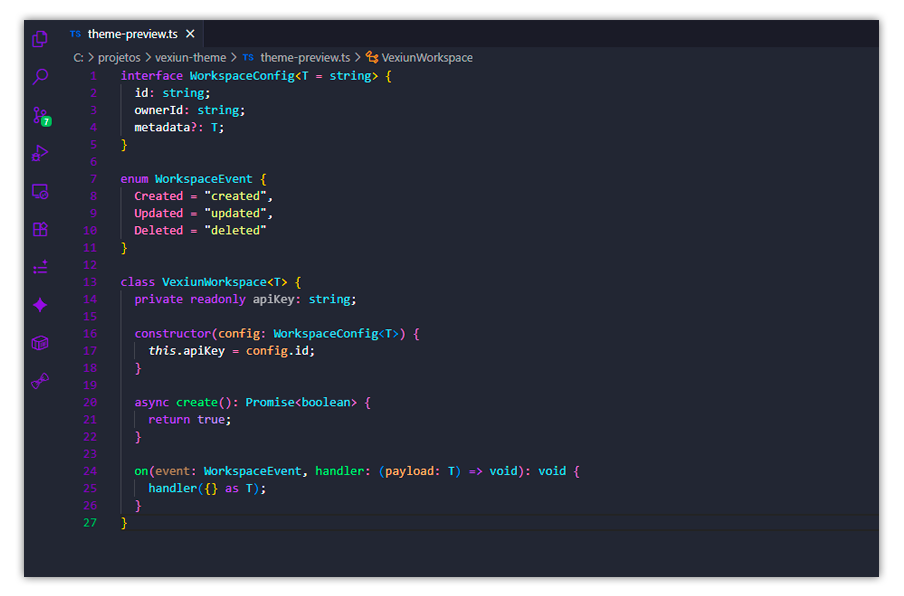
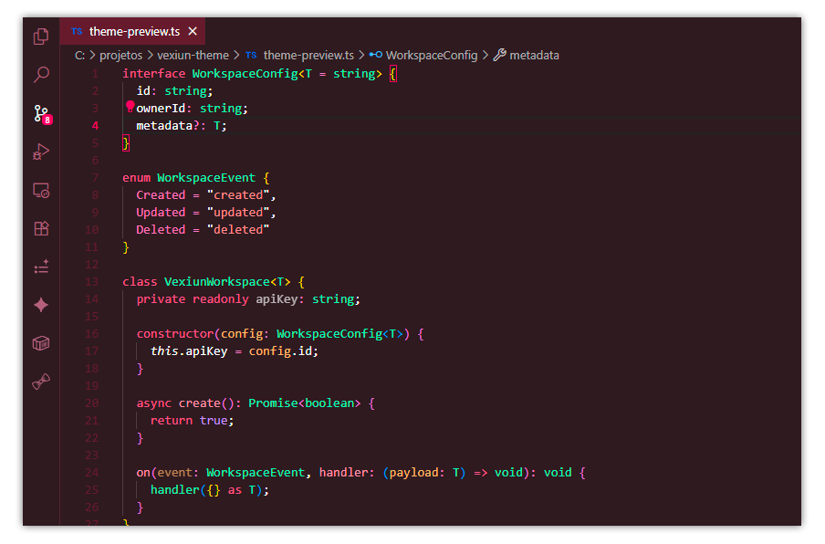
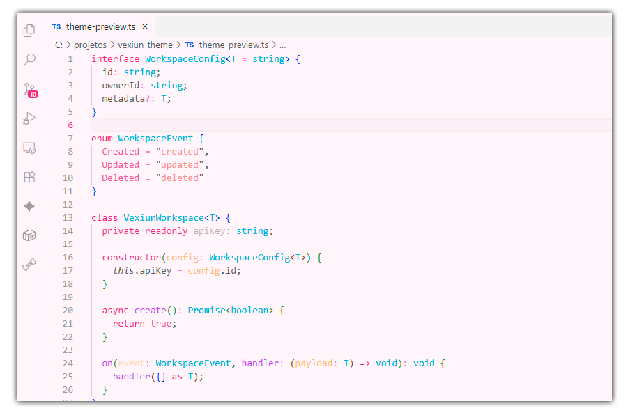

# Vexiun Theme Pack for Visual Studio Code

A modern, refined theme pack designed for serious TypeScript and React development.

Clean UI. Semantic precision. Visual clarity.

---

## Enable Full Semantic Highlighting (Recommended)

Vexiun Theme 1.0.4 uses advanced **Semantic Token Colors** to deliver refined highlighting for TypeScript, React, and modern backends.

To get the full experience, enable semantic highlighting:

### Enable in VS Code

Open your settings and make sure:

```json
{
  "editor.semanticHighlighting.enabled": true
}
```

Or:

- Press `Ctrl + Shift + P`
- Search: `Preferences: Open Settings (UI)`
- Search: `Semantic Highlighting`
- Enable it

## Why this matters?

With semantic highlighting enabled, you get:

- Clear distinction between function calls and declarations
- Async methods visually differentiated
- Readonly variables styled intentionally
- Better readability in Drizzle / Prisma queries
- Improved clarity in large TypeScript projects

Without semantic highlighting, VS Code falls back to basic TextMate scopes.

### Optimized for:

- React
- TypeScript
- Next.js
- Node.js
- Drizzle ORM
- Prisma

## Available Themes

### Vexiun Gray (Default)

Minimal, elegant, balanced contrast.


### Vexiun Bloom

Soft vibrant tones with refined semantic colors.


### Vexiun Sakura

Light theme with smooth contrast and consistent UI depth.


## Installation

1.  Open the **Extensions** sidebar in VS Code.
2.  Search for `Vexiun Theme`.
3.  Click **Install**.
4.  Open the **Command Palette** (`Ctrl+Shift+P` or `Cmd+Shift+P` on macOS).
5.  Search for `Preferences: Color Theme` and select it.
6.  Choose one of the `Vexiun` themes from the list.

## For More Information

- [Visual Studio Code Themes](https://code.visualstudio.com/docs/getstarted/themes)
- [Markdown Syntax Reference](https://help.github.com/articles/markdown-basics/)

**Enjoy!**
